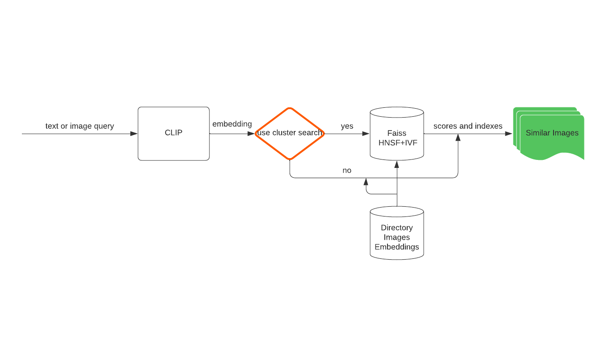
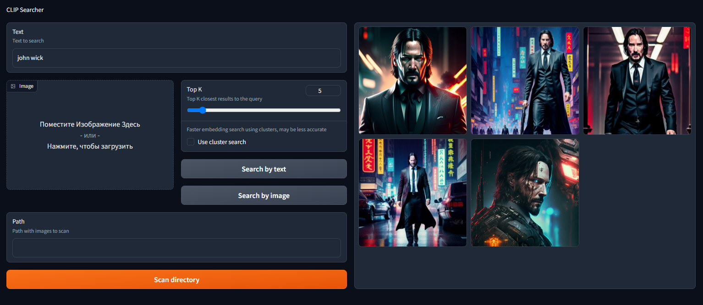

# CLIP-search
This is an impelementation of image search engine using CLIP (Contrastive Language-Image Pre-Training)

CLIP is a model that links text and images in a common space and makes it possible to understand the semantic relationship between them. CLIP is trained on a large dataset and is trained to understand how text and images relate to each other. CLIP can be used to classify images, search for similar images, generate text descriptions for images, and other tasks related to text and images.

The current implementation allows you to find images in a local directory based on either text or another image. The CLIP model first computes embeddings for the provided text or image. Then it compares these embeddings with the embeddings of images in the local directory to find similar images. Finally, it returns the top k similar images from the directory.

This implementation leverages the power of CLIP's embeddings to enable searching for visually or semantically similar images in a local directory. By computing embeddings for both the query and the images in the directory, it can efficiently compare and identify the most similar images based on their embeddings.

The implementation provides two methods for finding similar images:

1. Slow method: Computes the cosine similarity between the query and all images in the directory individually. Сan be computationally expensive and time-consuming for large directories.

2. Fast method: Utilizes clustering to find similar images by comparing the query with cluster centroids. Can be less accurate but faster. Speed matters for large directories.

You can choose between these methods based on your requirements for speed and accuracy.

This implementation utilizes the [Hugging Face CLIP model](https://huggingface.co/openai/clip-vit-base-patch32). The [Faiss](https://github.com/facebookresearch/faiss) library is used for clustering, and the web UI is built using [Gradio](https://gradio.app/).

Read more about CLIP at https://github.com/openai/CLIP.
